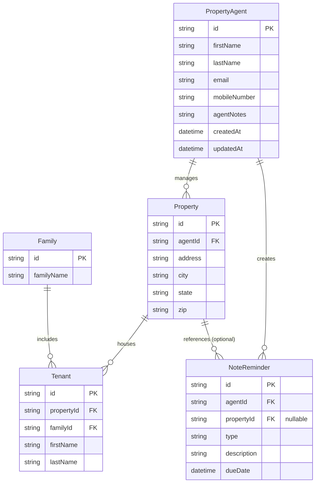

# Entity Relationship Diagram - PURE Home River

This diagram illustrates the data structure and relationships within the Property Agent Management Application.

### Key Relationships:
- **Agents to Properties**: A single agent manages multiple properties (One-to-Many).
- **Properties to Occupants**: Each property hosts one or more tenants, but all tenants in a property belong to the same family (One-to-Many).
- **Agents to Notes**: Agents create reminders for themselves, which can be general ("Across Portfolio") or linked to a specific property (One-to-Many).
- **Families to Tenants**: A family can have multiple members listed as tenants in a property.
